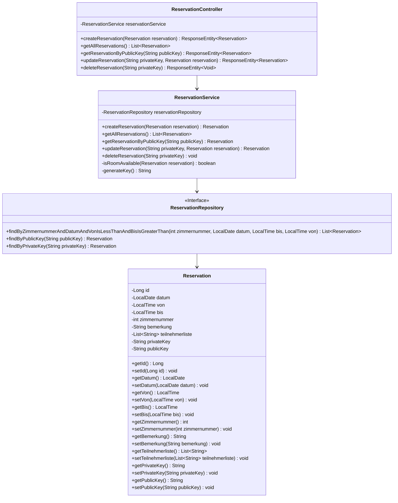

# Class Diagram

```mermaid
classDiagram
    class Reservation {
        -Long id
        -LocalDate datum
        -LocalTime von
        -LocalTime bis
        -int zimmernummer
        -String bemerkung
        -List~String~ teilnehmerliste
        -String privateKey
        -String publicKey
        +getId() Long
        +setId(Long id) void
        +getDatum() LocalDate
        +setDatum(LocalDate datum) void
        +getVon() LocalTime
        +setVon(LocalTime von) void
        +getBis() LocalTime
        +setBis(LocalTime bis) void
        +getZimmernummer() int
        +setZimmernummer(int zimmernummer) void
        +getBemerkung() String
        +setBemerkung(String bemerkung) void
        +getTeilnehmerliste() List~String~
        +setTeilnehmerliste(List~String~ teilnehmerliste) void
        +getPrivateKey() String
        +setPrivateKey(String privateKey) void
        +getPublicKey() String
        +setPublicKey(String publicKey) void
    }

    class ReservationController {
        -ReservationService reservationService
        +createReservation(Reservation reservation) ResponseEntity~Reservation~
        +getAllReservations() List~Reservation~
        +getReservationByPublicKey(String publicKey) ResponseEntity~Reservation~
        +updateReservation(String privateKey, Reservation reservation) ResponseEntity~Reservation~
        +deleteReservation(String privateKey) ResponseEntity~Void~
    }

    class ReservationService {
        -ReservationRepository reservationRepository
        +createReservation(Reservation reservation) Reservation
        +getAllReservations() List~Reservation~
        +getReservationByPublicKey(String publicKey) Reservation
        +updateReservation(String privateKey, Reservation reservation) Reservation
        +deleteReservation(String privateKey) void
        -isRoomAvailable(Reservation reservation) boolean
        -generateKey() String
    }

    class ReservationRepository {
        <<Interface>>
        +findByZimmernummerAndDatumAndVonIsLessThanAndBisIsGreaterThan(int zimmernummer, LocalDate datum, LocalTime bis, LocalTime von) List~Reservation~
        +findByPublicKey(String publicKey) Reservation
        +findByPrivateKey(String privateKey) Reservation
    }

    ReservationController --> ReservationService
    ReservationService --> ReservationRepository
    ReservationRepository --> Reservation
``` 