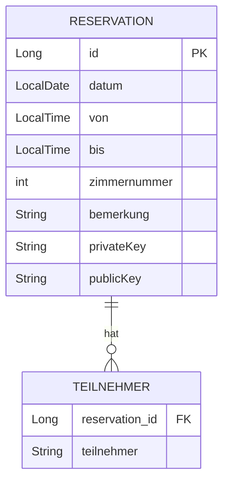

# ERD Diagram

```mermaid
erDiagram
    RESERVATION {
        Long id PK
        LocalDate datum
        LocalTime von
        LocalTime bis
        int zimmernummer
        String bemerkung
        String privateKey
        String publicKey
    }

    TEILNEHMER {
        Long reservation_id FK
        String teilnehmer
    }

    RESERVATION ||--o{ TEILNEHMER : "hat"
``` 