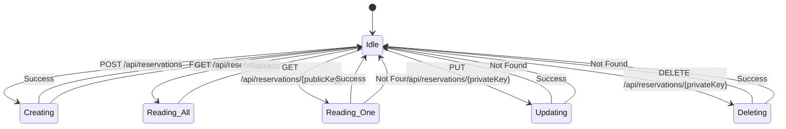

# State Diagram

```mermaid
stateDiagram-v2
    [*] --> Idle
    Idle --> Creating: POST /api/reservations
    Creating --> Idle: Success
    Creating --> Idle: Failure
    Idle --> Reading_All: GET /api/reservations
    Reading_All --> Idle: Success
    Idle --> Reading_One: GET /api/reservations/{publicKey}
    Reading_One --> Idle: Success
    Reading_One --> Idle: Not Found
    Idle --> Updating: PUT /api/reservations/{privateKey}
    Updating --> Idle: Success
    Updating --> Idle: Not Found
    Idle --> Deleting: DELETE /api/reservations/{privateKey}
    Deleting --> Idle: Success
    Deleting --> Idle: Not Found
``` 